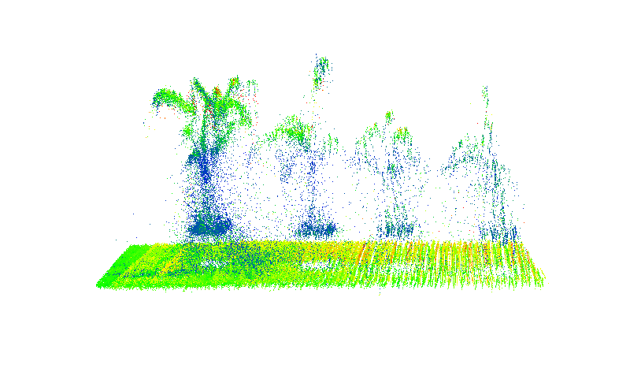
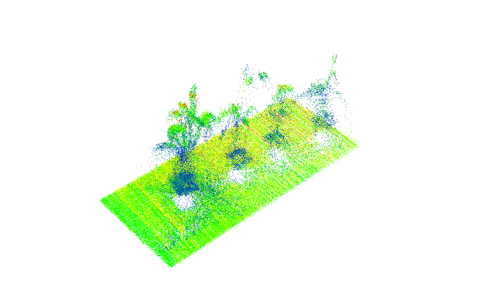
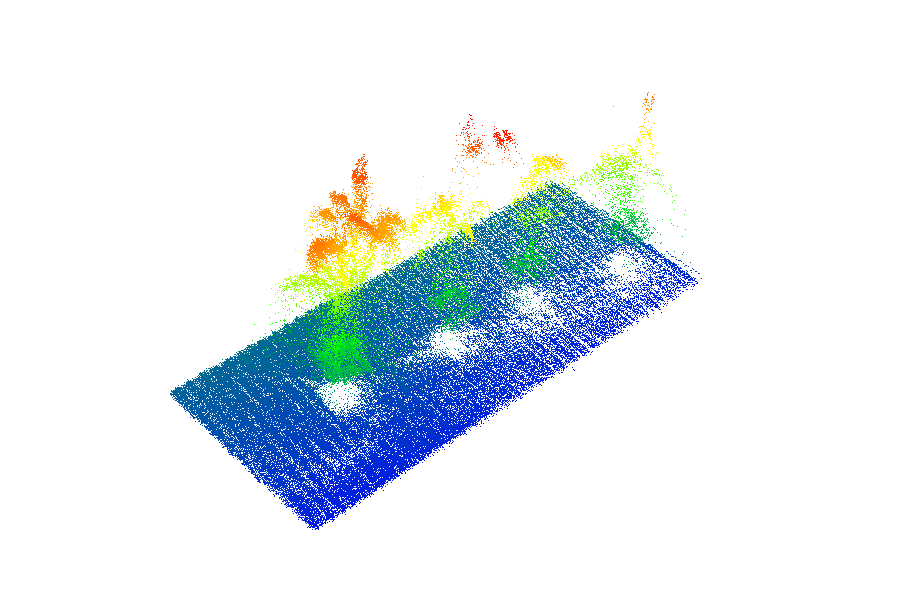

# Converting PCD files to CSV for wheat rust detection using LiDAR point data
 
Implementation of paper - [Monitoring leaf rust and yellow rust in wheat with 3D LiDAR sensing](#) - The full dataset used for this study is available on **Zenodo**:  
[](https://doi.org/10.5281/zenodo.14889285)  


<div align="center">
    <a href="./">
        
    </a>
    <a href="./">
        
    </a>
    <a href="./">
        
    </a>
</div>

## Installation & runnning the code

- The code use libraries well known. But check in your environment if you have all the libraries used in this code. Check in the folde ```inputs``` you will find the pcd files and in the folder ```outputs``` the csv files will be saved. Currently there is a test.pcd files can be used for testing purposed. 
```
git clone https://github.com/eapolo/agrolidarwheatrust.git
cd agrolidarwheatrust
python converter.py inputs outputs
```
- In the folder ```figures```, you will find the codes to generate each of the figures from the mentioned paper. The file ```data-rust-net.csv``` is used to generate the figures. The file ```test1.txt``` is a sample point cloud. However, if you want to explore the rest of the point clouds, you will need to download the data from Zenodo, as mentioned at the top of this document. 

## Device

- The code converts PCD (Point Cloud Data) files into CSV format. The PCD files were captured using a Velodyne VLP-16 sensor. After data collection, all ROS bag files generated by the LiDAR sensor were processed and converted using specific ROS commands to extract and store the point cloud data in a structured format.


## Acknowledgements

- This code was developed to convert PCD files to CSV by adapting the pypcd4 code published at [https://github.com/MapIV/pypcd4/tree/main](https://github.com/MapIV/pypcd4/tree/main), ensuring it precisely meets our specific conversion requirements. We also want to express our gratitude to the [AGR-278; Smart Biosystems Lab](https://smartbiosystemlab.com/team/) research group for their un-wavering support throughout this study.


